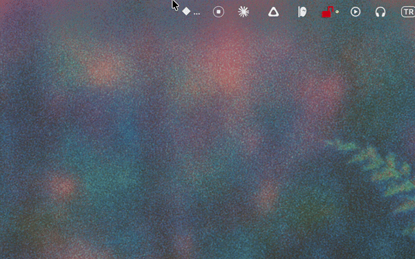

# Claude Usage Bar

**See your Claude.ai and ChatGPT usage limits live in your macOS menu bar.**

No Electron. No browser extension. One command to install.



[](https://www.apple.com/macos/)
[](https://www.python.org/)
[](LICENSE)
[](https://github.com/yagcioglutoprak/ClaudeUsageBar/stargazers)
[](https://github.com/yagcioglutoprak/ClaudeUsageBar/releases)
[](https://github.com/yagcioglutoprak/ClaudeUsageBar/releases/latest)
[](https://github.com/yagcioglutoprak/ClaudeUsageBar/commits/main)

**Featured on Hacker News (161 points, 49 comments) · Product Hunt (382 upvotes)**

---

## Why I built this

I kept getting cut off mid-session on Claude Pro with zero warning. Claude.ai doesn't show your usage until you hit the wall. Same with ChatGPT. So I built a tiny menu bar app that shows both.

---

## Install

```bash
curl -fsSL https://raw.githubusercontent.com/yagcioglutoprak/ClaudeUsageBar/main/install.sh | bash
```

That's it. The app launches immediately and auto-detects your Claude session from Chrome, Arc, Firefox, or Safari — no copy-pasting cookies.

---

## What it shows

| Menu bar | Meaning |
|---|---|
| 🟢 12% | Session usage is low — you're good |
| 🟡 83% | Approaching the 5-hour limit |
| 🔴 100% | Rate-limited — shows time until reset |
| 🔴 100% · | Session is fine but weekly limit is maxed |

Open the menu for full detail:

```
CLAUDE

  🟢 Current Session
  ██░░░░░░░░░░░░  12%
  resets in 3h 41m

  🟡 All Models
  ████████████░░  83%
  resets Wed 23:00

  🟢 Sonnet Only
  ███░░░░░░░░░░░  22%
  resets Wed 23:00

CHATGPT

  🟢 Codex Tasks
  █░░░░░░░░░░░░░  0%
  resets Thu 05:38

  🟢 Code Review
  █░░░░░░░░░░░░░  0%
  resets Thu 05:38
```

---

## Features

- **Zero-setup auth** — reads cookies directly from your browser (Chrome, Arc, Brave, Edge, Firefox, Safari)
- **Claude + ChatGPT** — tracks both Claude.ai session/weekly limits and ChatGPT usage in one place
- **Multi-provider** — add OpenAI, MiniMax, GLM (Zhipu) API keys to see spending alongside usage
- **Auto-refresh on session expiry** — silently grabs fresh cookies when your session expires
- **macOS notifications** — alerts at 80% and 95% usage
- **Configurable refresh** — 1 / 5 / 15 min
- **Runs at login** — via LaunchAgent, toggle from the menu
- **Tiny footprint** — ~900 lines of Python, no Electron, no background services beyond the app itself

---

## Why not just check the settings page?

| | ClaudeUsageBar | Open settings page | Browser extension |
|---|---|---|---|
| Always visible | ✅ Menu bar | ❌ Manual tab switch | ⚠️ Badge only |
| Notifications | ✅ 80% + 95% | ❌ None | ⚠️ Varies |
| Claude + ChatGPT | ✅ Both in one place | ❌ One at a time | ❌ |
| Privacy | ✅ Local only | ✅ | ⚠️ Depends on extension |
| Install | ✅ One command | ✅ Nothing | ❌ Store + permissions |
| No Electron | ✅ ~900 lines Python | ✅ | ❌ Often Electron |

---

## Requirements

- macOS 12+
- Python 3.10+
- A Claude.ai paid account
- Chrome, Arc, Brave, Edge, Firefox, or Safari with an active Claude session

---

## Manual install

```bash
git clone https://github.com/yagcioglutoprak/ClaudeUsageBar.git
cd ClaudeUsageBar
pip install -r requirements.txt
python3 claude_bar.py
```

---

## How it works

The app calls the same private usage API that `claude.ai/settings/usage` uses. It authenticates using your browser's existing session cookies (read locally — never transmitted anywhere except to `claude.ai`).

[`curl_cffi`](https://github.com/yifeikong/curl_cffi) is used to mimic a Chrome TLS fingerprint, which is required to pass Cloudflare's bot protection.

| API field | Displayed as |
|---|---|
| `five_hour` | Current Session |
| `seven_day` | All Models (weekly) |
| `seven_day_sonnet` | Sonnet Only (weekly) |
| `extra_usage` | Extra Usage toggle |

---

## Troubleshooting

**App doesn't appear in menu bar**
```bash
tail -50 ~/.claude_bar.log
```

**Cookies not detected**
Make sure you're logged into [claude.ai](https://claude.ai) in your browser, then click **Auto-detect from Browser** in the menu.

**Session expired / showing ◆ !**
The app will try to auto-detect fresh cookies from your browser. If that fails, click **Set Session Cookie…**.

---

## Roadmap

- [ ] Homebrew formula (`brew install --cask claude-usage-bar`)
- [ ] Linux system tray support
- [ ] Windows tray app
- [ ] Customizable notification thresholds
- [ ] Usage history graph
- [ ] Multiple Claude account support

---

## Contributing

PRs welcome. Open an issue first for large changes.

To run in development:
```bash
git clone https://github.com/yagcioglutoprak/ClaudeUsageBar.git
cd ClaudeUsageBar
pip install -r requirements.txt
python3 claude_bar.py
```

Logs are written to `~/.claude_bar.log`.

---

## License

MIT — see [LICENSE](LICENSE).

## Disclaimer

Not affiliated with or endorsed by Anthropic. Uses undocumented internal APIs that may change without notice.
